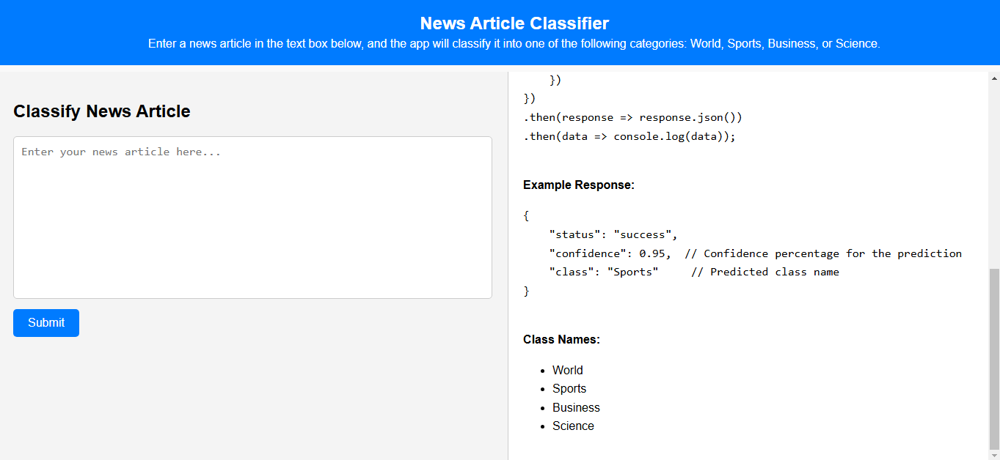

# News Article Classifier

This project is a **News Article Classifier** that categorizes news articles into one of four classes: **World**, **Sports**, **Business**, or **Science**. It uses a **Naive Bayes classifier** trained on a dataset of news articles. The project includes a Flask-based web application for real-time inference.

---
## Demo

Check out the live demo of the application here:

[Demo Link](https://news-article-multiclass-classifier.onrender.com/)



## Table of Contents

1. [Project Overview](#project-overview)
2. [Folder Structure](#folder-structure)
3. [How It Works](#how-it-works)
4. [Training the Model](#training-the-model)
5. [Running Inference](#running-inference)
6. [Requirements](#requirements)
7. [Demo](#demo)
8. [License](#license)

---

## Project Overview

The goal of this project is to classify news articles into one of four categories:

- **World**
- **Sports**
- **Business**
- **Science**

The project consists of:

- A **training pipeline** (`train.ipynb`) that preprocesses the data, trains a Naive Bayes model, and saves the model and vectorizer.
- A **Flask web application** (`app.py`) that provides a user interface for classifying news articles in real-time.
- A **pre-trained model** (`naive_bayes_model.pkl`) and **vectorizer** (`tfidf_vectorizer.pkl`) for inference.

---

## Folder Structure

news-article-classifier/
│
├── templates/
│ └── index.html # HTML template for the Flask web app
│
├── data/
│ ├── train.csv # Training dataset
│ └── test.csv # Testing dataset
│
├── naive_bayes_model.pkl # Pre-trained Naive Bayes model
├── tfidf_vectorizer.pkl # Pre-trained TF-IDF vectorizer
│
├── train.ipynb # Jupyter notebook for training the model
├── app.py # Flask application for inference
├── test.py # test for the endpoint
│
├── requirements.txt # Python dependencies
├── demo_screenshot.png # Screenshot of the web app
│
└── README.md # Project documentation

---

## How It Works

1. **Training**:

   - The training pipeline (`train.ipynb`) preprocesses the news articles by:
     - Removing HTML tags, URLs, stopwords, and punctuation.
     - Tokenizing and stemming the text.
     - Converting the text into TF-IDF vectors.
   - A **Naive Bayes classifier** is trained on the preprocessed data.
   - The trained model and vectorizer are saved as `.pkl` files for inference.

2. **Inference**:
   - The Flask web app (`app.py`) loads the pre-trained model and vectorizer.
   - Users can input a news article into the web interface.
   - The app preprocesses the input text, converts it into a TF-IDF vector, and predicts the class using the trained model.
   - The predicted class and confidence score are displayed to the user.

---

## Training the Model

To train the model:

1. Open the `train.ipynb` notebook.
2. Run all cells to:
   - Load the training and testing datasets (`data/train.csv` and `data/test.csv`).
   - Preprocess the data.
   - Train the Naive Bayes model.
   - Save the model (`naive_bayes_model.pkl`) and vectorizer (`tfidf_vectorizer.pkl`).

---

## Running Inference

To run the Flask web app:

1. Install the required dependencies:

   ```bash
   pip install -r requirements.txt bash
   ```

2. Start the Flask app:

   ```bash
       python app.py
   ```

3. Open your browser and go to http://127.0.0.1:5000/.

4. Enter a news article in the text box and click "Submit" to see the predicted class and confidence score.

## Requirements

The project requires the following Python libraries: - Flask - cikit-learn - pandas - numpy - nltk - joblib
Install the dependencies using:

```bash
    pip install -r requirements.txt
```

Demo

Here’s a screenshot of the web app in action:

Demo Screenshot


## Acknowledgments

The dataset used for training and testing is sourced from Kaggle.


This project is inspired by the following Kaggle notebook:

[News Article Multiclass Classifier by Amnanandrai](https://www.kaggle.com/code/amananandrai/news-article-multiclass-classifier)

## The project uses the scikit-learn library for machine learning and Flask for the web interface.

### **How to Use**

1. Copy the above Markdown code.
2. Paste it into a file named `README.md` in the root directory of your project.
3. Replace `demo_screenshot.png` with the actual screenshot of your web app (if available).
4. Update the `LICENSE` file if you choose a different license.

This `README.md` provides a professional and structured overview of your project. Let me know if you need further assistance! 🚀
